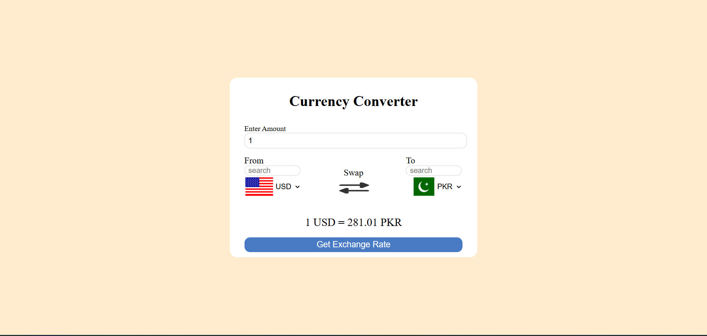

# 💰 Currency Converter App

> 🔹 A responsive and real-time **Currency Converter Web App** built using **HTML, CSS, and JavaScript**.

---

## 🚀 Live Demo

🌐 **Try it here:** [https://your-netlify-link.netlify.app](https://your-netlify-link.netlify.app)

## 🧩 Features

✅ Convert between **any two currencies**  
🔁 **Swap** currencies easily  
🏳️‍🌈 Display **country flags** dynamically  
💱 Fetch **live exchange rates** (via Fawaz Ahmed API)  
🔍 Search and **filter** currencies  
⏳ Show a **loading spinner** while fetching data  
📱 Fully **responsive** and mobile-friendly design

---

## ⚙️ Technologies Used

| Technology                        | Purpose                  |
| --------------------------------- | ------------------------ |
| 💻 **HTML5**                      | Structure of the app     |
| 🎨 **CSS3**                       | Styling and layout       |
| ⚡ **JavaScript (ES6)**           | App logic & API handling |
| 🏴 **Flags API**                  | Display country flags    |
| 💹 **Currency API (Fawaz Ahmed)** | Real-time exchange rates |

---

## 🧠 How It Works

1️⃣ Enter an amount  
2️⃣ Select **From** and **To** currencies  
3️⃣ Click **Get Exchange Rate**  
4️⃣ Instantly view the converted amount

---

## 📸 Screenshot

